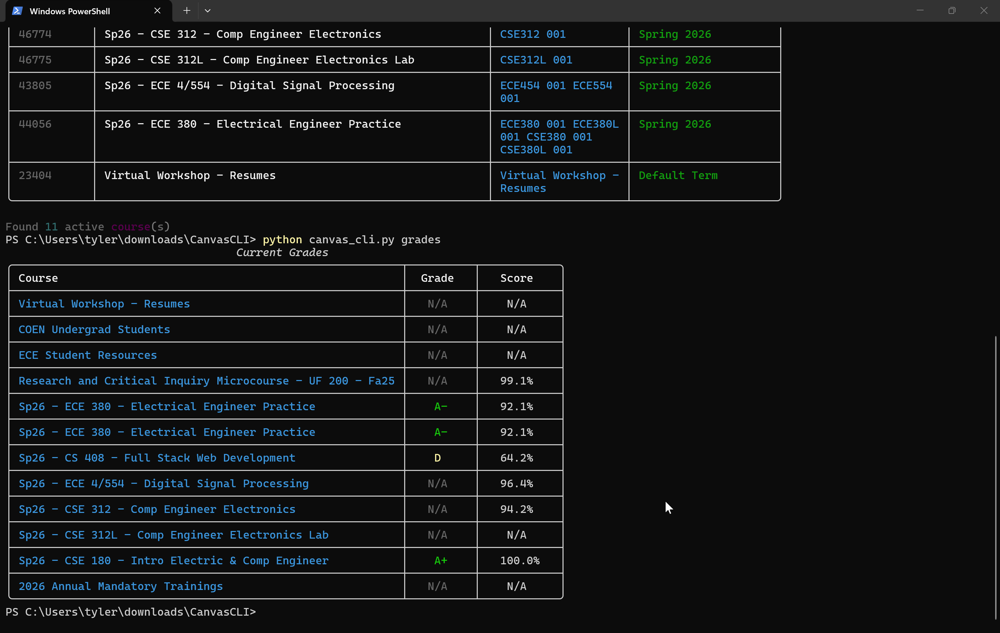

# Canvas CLI

A terminal tool for Boise State's Canvas LMS. Check your courses, upcoming assignments (color-coded by urgency), and current grades — all without opening a browser.



---

## Setup

**Requirements:** Python 3.8+

### 1. Clone the repo

```bash
git clone https://github.com/YOUR_USERNAME/canvas-cli.git
cd canvas-cli
```

### 2. Install dependencies

It's recommended (but not required) to use a virtual environment:

```bash
python -m venv venv
source venv/bin/activate      # Windows: venv\Scripts\activate
```

Then install packages:

```bash
pip install -r requirements.txt
```

### 3. Create your `.env` file

```bash
cp .env.example .env
```

Open `.env` and replace `your_canvas_token_here` with your real token.

**How to get a token:**
1. Log in to [boisestatecanvas.instructure.com](https://boisestatecanvas.instructure.com)
2. Click your profile picture (bottom-left) → **Settings**
3. Scroll to **Approved Integrations** → click **+ New Access Token**
4. Set a purpose and expiry date, then click **Generate Token**
5. Copy the token — Canvas only shows it once

> ⚠️ Never commit your `.env` file. It's already in `.gitignore`.

### 4. Run it

```bash
python canvas_cli.py --help
```

---

## Usage

### List your active courses

```bash
python canvas_cli.py courses
```

**Example output:**
```
╭──────────┬────────────────────────────────┬────────────────────┬──────────────────────╮
│ ID       │ Course Name                    │ Code               │ Term                 │
├──────────┼────────────────────────────────┼────────────────────┼──────────────────────┤
│ 123456   │ Software Engineering           │ CS4XX-001          │ Spring 2025          │
│ 123457   │ Computer Architecture          │ ECE3XX-002         │ Spring 2025          │
╰──────────┴────────────────────────────────┴────────────────────┴──────────────────────╯

Found 2 active course(s)
```

---

### List upcoming assignments

```bash
python canvas_cli.py assignments
```

Assignments are sorted by due date and color-coded:
- 🔴 **Red** — due within 24 hours
- 🟡 **Yellow** — due within 7 days
- 🟢 **Green** — due later

**Filter by course:**
```bash
python canvas_cli.py assignments --course-id 123456
```

**Include past/overdue assignments:**
```bash
python canvas_cli.py assignments --all
```

**Example output:**
```
╭─────────────────┬────────────────────────────┬──────────────────────────────────────┬─────┬──────────────╮
│ Due             │ Course                     │ Assignment                           │ Pts │ Status       │
├─────────────────┼────────────────────────────┼──────────────────────────────────────┼─────┼──────────────┤
│ 04/15  11:59 PM │ Software Engineering       │ Mini-Lab: Canvas API CLI             │ 100 │ DUE SOON     │
│ 04/17  11:59 PM │ Computer Architecture      │ Lab 9: Cache Simulation              │  50 │ This Week    │
│ 04/22  11:59 PM │ Software Engineering       │ Project Specification v2             │ 150 │ Upcoming     │
╰─────────────────┴────────────────────────────┴──────────────────────────────────────┴─────┴──────────────╯

Showing 3 assignment(s)
```

---

### Show current grades

```bash
python canvas_cli.py grades
```

**Example output:**
```
╭──────────────────────────────────────┬───────┬────────╮
│ Course                               │ Grade │ Score  │
├──────────────────────────────────────┼───────┼────────┤
│ Software Engineering                 │  A    │ 94.2%  │
│ Computer Architecture                │  B+   │ 88.5%  │
╰──────────────────────────────────────┴───────┴────────╯
```

---

## API Endpoints Used

| Method | Endpoint | Used For |
|--------|----------|----------|
| `GET` | `/api/v1/courses` | Fetches active courses and their names/codes/terms |
| `GET` | `/api/v1/courses/:id/assignments` | Fetches assignments per course (with submission status) |
| `GET` | `/api/v1/users/self/enrollments` | Fetches current grade and score per course |

All endpoints handle Canvas's pagination via `Link` response headers.

---

## Reflection

The biggest thing that I learned from this project was how REST API authentication actually works in practice. Reading about bearer tokens is one thing but writing code that puts them in request headers and handles a 401 when they're wrong is another thing. I also didn't realize how much real-world APIs lean on pagination, Canvas limits almost every list endpoint to 100 items by default.

I used Claude pretty heavily on this one, the HTTP request loop, pagination logic, and the rich table formatting. That part was really useful as it let me skip tedious stuff and focus on the tools functionality and structure the commands. I did have to test it against live Canvas data and fix a few things like courses coming back without a name field and assignments with null due dates crashing the sort.

If I had more time I'd add a submit command. The Canvas API supports file submissions using POST and it could make the tool actually practical for day-to-day use. I would also like to clean up some of the edge cases for courses with no assignments as well as a --json flag so the output could be piped elsewhere into other tools.

---

## Project Structure

```
canvas-cli/
├── canvas_cli.py       # main script
├── requirements.txt    # dependencies
├── .env.example        # template for your token
├── .gitignore          # keeps .env out of git
├── assets/
│   └── demo.gif        # terminal demo recording
└── README.md
```
